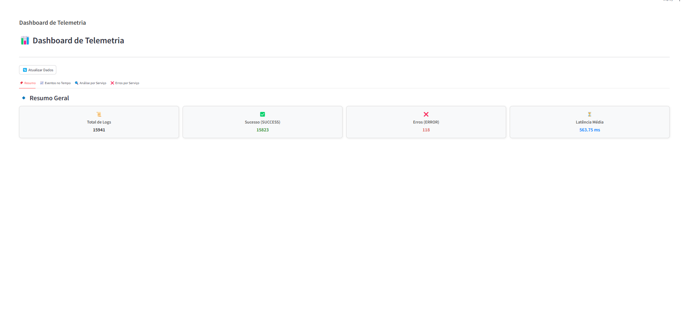
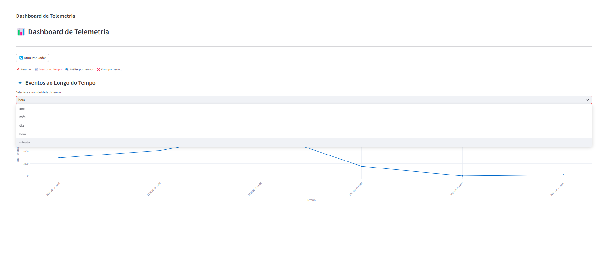
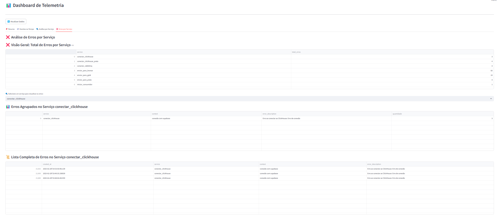

# Dashboard de Telemetria

## Introdução 

O **Dashboard de Telemetria** foi desenvolvido para monitorar e analisar os logs de eventos gerados no módulo de ingestão de dados.

## Arquitetura do Dashboard

### Fluxo de Dados

1. O Python consome os dados de logs do Supabase através de consultas otimizadas.
2. Os dados são agregados e processados em tempo real.
3. O Streamlit exibe os resultados de forma interativa.

#### Estrutura do Projeto
```bash
📂
├── 📂 components/  # Configurações gerais do projeto, como estilo, variáveis etc.
├── 📂 config/  # Módulos de análise e agregação dos dados
├── 📂 visoes/  # Elementos visuais do dashboard
├── main.py  # Arquivo principal do dashboard
```

## Passos para Executar o Dashboard

### 1. Configurar o `.env`
```bash
# 1. Crie o.env na raiz do projeto e coloque as informações:
SUPABASE_URL=
SUPABASE_API_KEY=
```

### 2. Instalar dependências
```bash
 poetry install
```

### 3. Executar o dashboard
```bash
 poetry run streamlit run main.py
```

## Métricas Utilizadas

### KPIs do Dashboard

- **Total de Logs** → Contagem total de eventos processados.
- **Eventos de Sucesso** → Contagem de eventos com `level_type = SUCCESS`.
- **Eventos com Erro** → Contagem de eventos com `level_type = ERROR`.
- **Latência Média** → Média de `latency_ms` para avaliar desempenho.
- **Eventos por Serviço** → Distribuição dos eventos por `service`.
- **Eventos ao Longo do Tempo** → Distribuição de logs ao longo dos dias/horas/minutos.
- **Erros por Serviço** → Identificação dos serviços que apresentam maior taxa de erro.


## Design e Usabilidade

### Características do Design

- **Interface intuitiva** → Componentes bem organizados e legíveis.
- **Gráficos interativos** → Uso de Plotly para facilitar a análise.
- **Filtro de Tempo** → Permite selecionar granularidade (ano, mês, dia, hora, minuto).
- **Botão de Refresh** → Atualiza os dados sem precisar reiniciar o app.
- **Navegação Estruturada** → O dashboard está organizado em diferentes abas para facilitar a visualização das métricas.

### Uso de IA para Aprimoramento do Design

Para garantir um design mais eficiente e intuitivo, utilizamos ferramentas de IA para otimizar a interface do dashboard. A IA auxiliou na escolha de cores, disposição dos elementos e interatividade, garantindo uma experiência aprimorada para o usuário.

## Estrutura do Dashboard

Para garantir uma melhor usabilidade e experiência do usuário, o dashboard foi dividido em **quatro seções principais**:

### Resumo

A seção de Resumo apresenta os principais KPIs do sistema de forma objetiva, utilizando "Big Numbers" para facilitar a visualização rápida dos indicadores mais importantes, como total de logs, eventos de sucesso, erros e latência média.



####  Eventos no Tempo

A seção Eventos ao Longo do Tempo permite visualizar a distribuição dos logs conforme a granularidade desejada (ano, mês, dia, hora ou minuto). Essa funcionalidade é útil para identificar padrões e anomalias no processamento de eventos ao longo do tempo.



#### Análise por Serviço

Essa seção exibe uma visão detalhada sobre a quantidade e latência média dos eventos por serviço. A análise por serviço permite identificar quais serviços são mais demandados e quais podem estar impactando a performance geral do sistema devido a latências elevadas.


#### Erros por Serviço

Nessa seção, é possível visualizar:

- **Visão Geral**: O dashboard apresenta um **resumo da quantidade total de erros por serviço**.
- **Seleção de Serviço**: O usuário pode selecionar um serviço específico para visualizar detalhes sobre os erros.
- **Tabela de Erros Agrupados**: Exibe os erros agrupados por `service - context - error_description`, permitindo identificar padrões e recorrências.
- **Tabela Detalhada de Erros**: Lista todos os erros individualmente, incluindo `created_at - service - context - error_description`.

Essa visão permite um diagnóstico rápido e eficiente dos principais problemas nos serviços, auxiliando na tomada de decisão e correção de falhas.

Além disso, com esse dashboard, foi possível identificar que o módulo `data_ingestion` está enviando um número excessivo de eventos de `iniciar_producer` e `consumer_callback`. Essa descoberta gerou um insight crítico sobre desperdício de processamento, e como resultado, na próxima sprint, esse comportamento será otimizado para reduzir o consumo de recursos.




## Insights e Análises

A partir dos dados analisados, algumas informações valiosas foram extraídas:

- **Picos de Processamento** → Identificação dos horários de maior volume de eventos.
- **Serviços com Maior Latência** → Análise de gargalos no processamento.
- **Taxa de Erros** → Quais serviços apresentam mais falhas?
- **Tendência de Uso** → Como o volume de eventos evolui ao longo do tempo?

### Descobertas Importantes

Durante a análise dos logs, foi possível identificar um número excessivo de eventos dos serviços iniciar_producer e consumer_callback. Essa descoberta apontou um possível desperdício de processamento, que será tratado na próxima sprint para reduzir o consumo de recursos e otimizar a eficiência do sistema.

## Conclusão

A capacidade de visualizar dados em tempo real, acompanhar tendências e detectar problemas antes que impactem os usuários é essencial para a evolução do sistema. Com base nas análises realizadas, serão implementadas melhorias para otimizar o consumo de recursos, reduzir a latência e diminuir a quantidade de eventos desnecessários. Com isso, o Dashboard se consolida como um recurso estratégico para a gestão eficiente da ingestão de dados e garantia de qualidade dos serviços monitorados.


